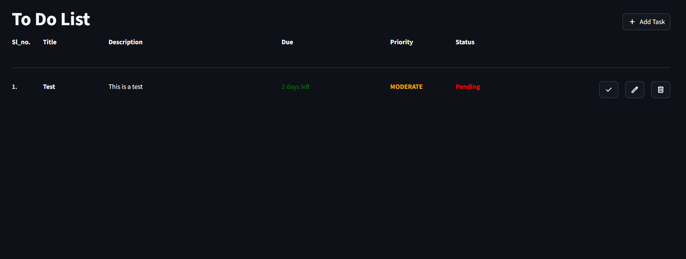
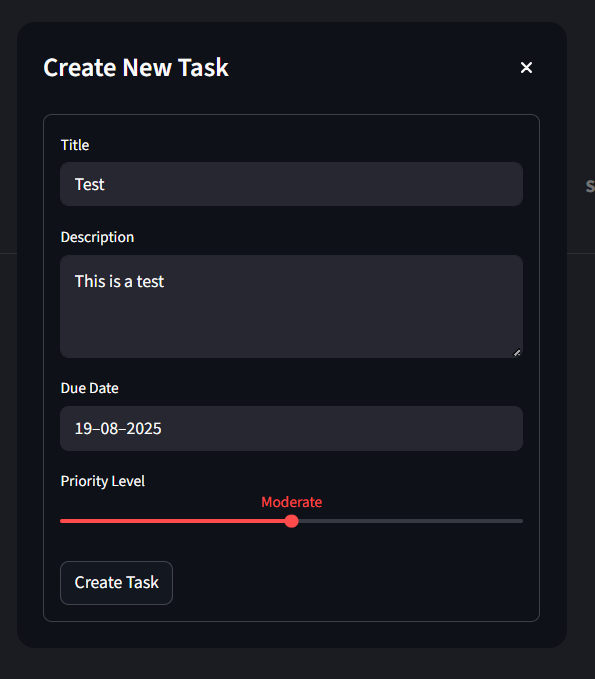

# 📝 ToDo List Application

A simple yet powerful ToDo List app built with **Python** and **Streamlit**, allowing you to add, view, update, and delete tasks with priority levels and due dates.  
Easily run locally or using Docker.

---

## 🚀 Installation

### 1️⃣ Clone the Repository
```bash
git clone https://github.com/dattu095/todo_list.git
cd todo_list
```

### 2️⃣ Install Dependencies
```bash
pip install -r requirements.txt
```

### 3️⃣ Run the App
```bash
streamlit run src/main.py
```

Go to 👉 **http://localhost:8501** in your browser to access the app.

---

## 🐳 Docker Setup

### Build Docker Image
```bash
docker build -t todo .
```

### Run Docker Container
```bash
docker run -p 8501:8501 todo:latest
```

Visit 👉 **http://localhost:8501** to use the app.

---

## 📌 Features
- ➕ Add new tasks with **title**, **priority**, and **due date**  
- ✅ Mark tasks as completed or pending  
- 🗑 Delete tasks  
- 📅 See days remaining until the due date  
- 🎨 Simple, clean, and responsive UI

---

## ⚙️ Tech Stack
- **Python 3.12+**
- **Streamlit** – Web UI framework
- **Docker** – Containerization
- **Datetime** – Due date handling

---

## Useage

### 🏠 Main Screen
When you open the app, you'll see the *task list* showing all tasks with their:
- Title
- Description
- Due Date (with remaining days)
- Priority
- Status (Pending / Completed)

From here, you can:
- ✅ Mark a task as completed
- ✏️ Edit a task
- 🗑 Delete a task

Screenshot:


### ➕ Create / ✏️ Edit Task
Click on *Add Task* (or *Edit* for existing tasks) to open the task dialog.
You can:
- Enter or update the *Title*
- Add a *Description*
- Select a *Due Date*
- Choose a *Priority Level*

Screenshot:


---
